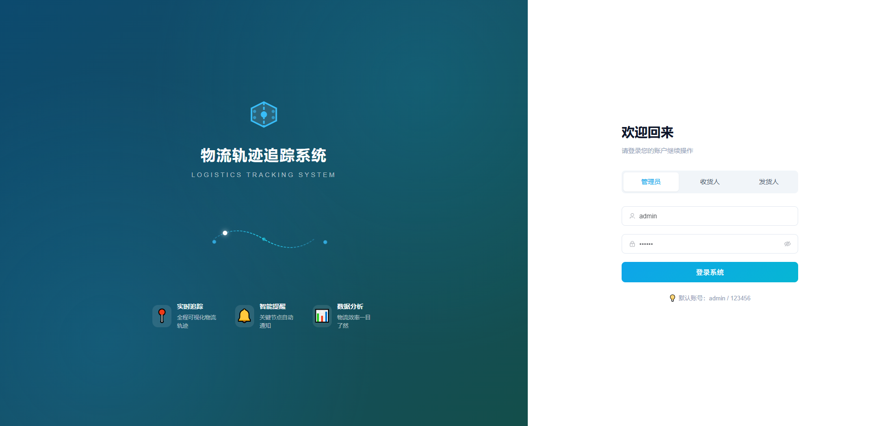
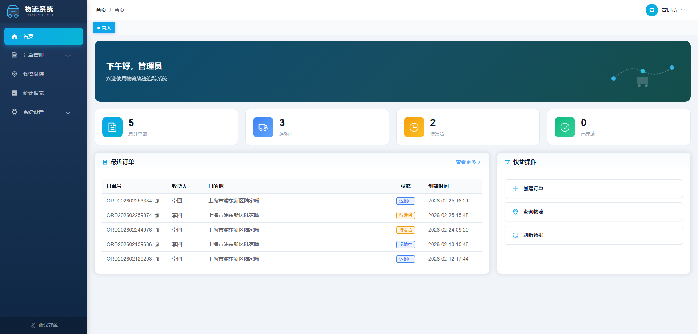
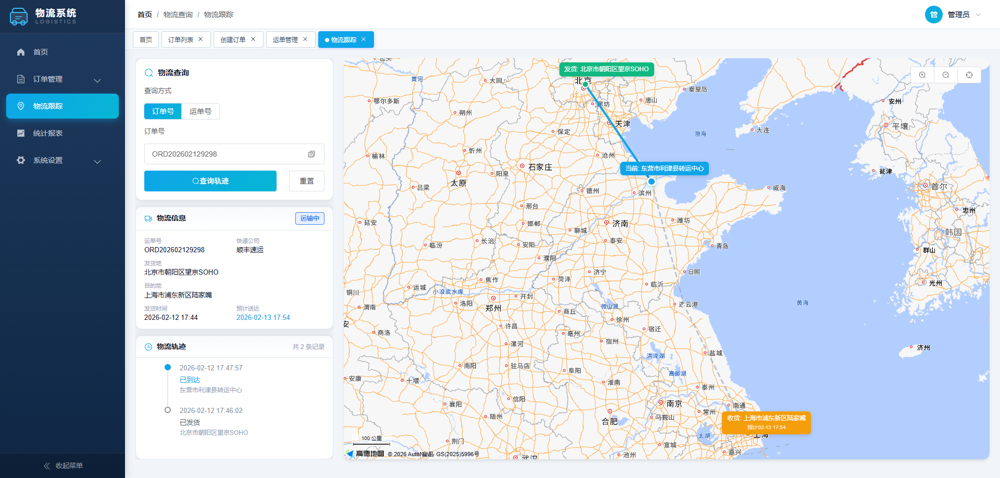
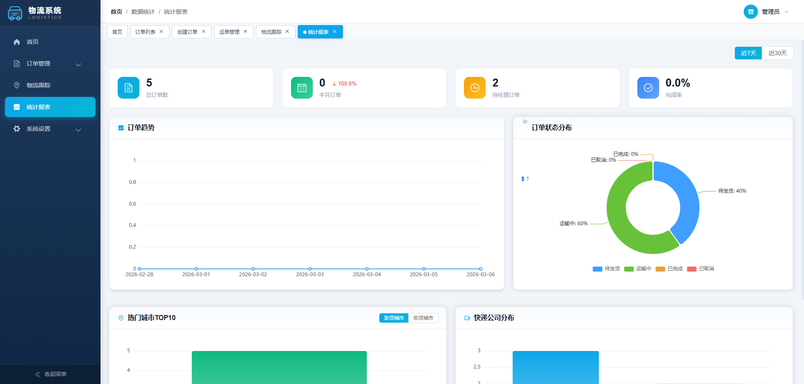
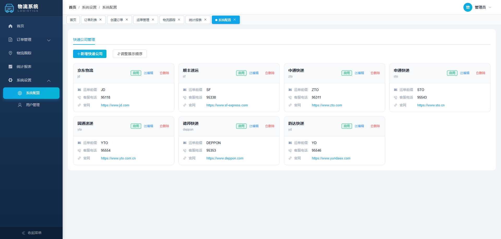

# 物流轨迹追踪系统

一个基于 Vue 3 + Spring Boot 的全栈物流管理系统，支持订单管理、物流追踪、数据统计等功能。

## 📸 系统截图

<table>
  <tr>
    <td></td>
    <td></td>
  </tr>
  <tr>
    <td></td>
    <td></td>
  </tr>
  <tr>
    <td colspan="2"></td>
  </tr>
</table>

## ✨ 功能特性

### 多角色支持

- **管理员**：订单管理、运单管理、数据统计、系统设置
- **买家**：查询个人订单、物流追踪
- **卖家**：发货管理、运输列表查询

### 核心功能

- 📦 订单管理：创建、编辑、批量导入/导出
- 🚚 物流追踪：实时轨迹查询、地图可视化
- 📊 数据统计：订单趋势、状态分布、ECharts 图表
- 🏢 快递公司管理：增删改查
- 👤 用户管理：账号密码登录、手机号验证码登录

## 🛠️ 技术栈

### 前端

- Vue 3 + TypeScript
- Vite 7
- Element Plus
- Vue Router 4
- Pinia
- ECharts
- Axios

### 后端

- Spring Boot 4
- Spring Data JPA
- MySQL
- Apache POI（Excel 处理）
- 高德地图 API

## 🚀 快速开始

### 环境要求

- Node.js 18+
- Java 21+
- MySQL 8+

### 前端启动

```bash
cd frontEnd
pnpm install
pnpm dev
```

### 后端启动

```bash
cd javaService/demo
./mvnw spring-boot:run
```

### 一键启动（Windows）

```bash
# 启动前后端
start-dev.bat

# 停止服务
stop-dev.bat
```

## 📁 项目结构

```
├── frontEnd/                # 前端项目
│   ├── src/
│   │   ├── api/            # API 接口
│   │   ├── components/     # 公共组件
│   │   ├── layouts/        # 布局组件
│   │   ├── router/         # 路由配置
│   │   ├── store/          # 状态管理
│   │   ├── styles/         # 全局样式
│   │   ├── views/          # 页面视图
│   │   └── utils/          # 工具函数
│   └── ...
├── javaService/demo/        # 后端项目
│   └── src/main/java/com/example/demo/
│       ├── controller/     # 控制器
│       ├── service/        # 业务逻辑
│       ├── repository/     # 数据访问
│       ├── entity/         # 实体类
│       └── dto/            # 数据传输对象
└── showPhoto/              # 系统截图
```

## 📝 默认账号

| 角色   | 账号  | 密码   |
| ------ | ----- | ------ |
| 管理员 | admin | 123456 |

买家/卖家可通过手机号 + 验证码登录。

## 📄 License

MIT
