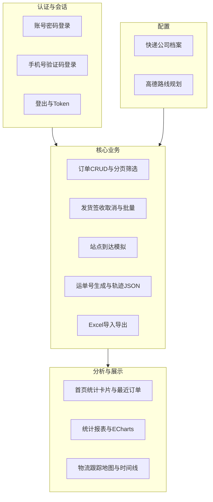
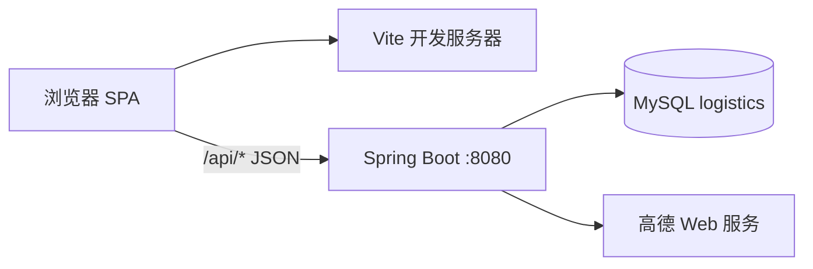

# 物流轨迹追踪系统——系统实现说明文档

---

**文档版本**：1.0  
**适用项目**：Logistics_Management_System（物流轨迹追踪系统）  
**编写目的**：为毕业论文「系统设计与实现」章节提供与代码一致的功能描述、技术架构与分模块实现说明。  
**依据代码库**：`frontEnd/`（Vue 3 前端）、`javaService/demo/`（Spring Boot 后端）、根目录 `README.md`。

---

# 1. 功能概述

## 1.1 建设背景与建设目标

随着电商与同城配送规模扩大，物流订单产生速度快、参与角色多（平台管理员、发货方、收货方），传统以表格或电话为主的跟踪方式难以满足「一单到底」的可视化与可追溯需求。本系统以**订单全生命周期管理**为主线，将**运单生成、在途轨迹、站点到达、签收与取消**等环节纳入统一数据模型，并在 Web 端提供**多角色入口、统计分析与地图展示**，形成一套可演示、可扩展的教学型物流管理系统。

建设目标可概括为：

1. **业务闭环**：支持从订单创建、待发货、运输中、已完成到已取消的状态流转，并对关键操作写入操作日志。  
2. **多角色协同**：管理员负责全局订单与基础数据；卖家按发货人手机号维度管理「我的发货」与运输列表；买家按收货人手机号维度查看「我的订单」。  
3. **可观测性**：提供仪表盘与统计报表（趋势、分布、热门城市、承运商占比等），辅助运营分析。  
4. **地理信息能力**：集成高德地图 Web 服务，实现驾车路线规划、地理编码及前端地图轨迹展示。  
5. **批量与效率**：支持 Excel 模板批量导入订单、按条件或勾选导出、批量发货与批量签收等操作。

## 1.2 系统定位与适用范围

本系统定位为**前后端分离的 B/S 架构 Web 应用**：浏览器访问前端单页应用（SPA），通过 RESTful API 与后端通信；后端持久化至 MySQL，并通过 JPA 维护实体关系。适用于：

- 毕业设计/课程设计中「物流信息管理」「供应链可视化」类课题的实现载体；  
- 中小团队内部演示或原型验证（非高并发金融级生产场景）。

**边界说明**：认证模块当前采用内存模拟用户与 Token 存储，验证码在服务端日志中输出，便于开发联调；若用于真实生产，需替换为数据库用户表、短信网关、JWT 与刷新令牌等方案。

## 1.3 用户角色与权限模型

系统在前端路由层与菜单层按角色过滤资源，在后端部分接口按 Token 解析出的**手机号**过滤数据，形成「界面权限 + 数据范围」的双重约束。

| 角色 | 标识 | 典型入口 | 主要能力概要 |
|------|------|----------|----------------|
| 管理员 | `admin` | 账号密码登录，默认 `/dashboard` | 订单列表/创建/运单、导入导出、统计报表、快递公司管理 |
| 买家 | `buyer` | 手机号 + 验证码登录，`/buyer/orders` | 仅查看收货人手机号为本人手机号的订单及统计 |
| 卖家 | `seller` | 手机号 + 验证码登录，`/seller/shipment` | 发货、运输列表；数据按发货人手机号过滤 |

**全员可访问**：登录后均可使用「物流查询」模块（订单号/运单号查轨迹），便于三端统一体验。

前端通过 `localStorage` 保存 `token`，并在买家/卖家登录时额外写入 `buyerPhone` 或 `sellerPhone`，供路由守卫在**无后端角色声明**的情况下推断当前会话角色（与 `Pinia` 用户仓库逻辑一致）。

## 1.4 总体功能架构

从用户视角，功能可归纳为**认证层、业务层、分析层、配置层**：

## 1.5 技术架构选型

### 1.5.1 前端技术栈

| 技术 | 作用 |
|------|------|
| Vue 3 + TypeScript | 组件化 UI 与类型约束 |
| Vite | 开发与构建工具链 |
| Vue Router 4 | 路由、懒加载、全局前置守卫 |
| Pinia | 全局用户状态、标签页等 |
| Element Plus | 表格、表单、对话框、时间线等企业级组件 |
| Axios | HTTP 客户端；统一 BaseURL、Token 头、响应解包 |
| ECharts（经封装组件） | 折线、柱状、饼图等统计图表 |

前端源码主要位于 `frontEnd/src/`：`views` 为页面，`api` 为接口封装，`components` 为可复用业务组件与布局，`router` 为常量路由与异步路由及按角色过滤函数，`store` 为 Pinia 模块，`utils/request` 为 Axios 实例与拦截器。

### 1.5.2 后端技术栈

| 技术 | 作用 |
|------|------|
| Spring Boot | IoC 容器、Web MVC、自动配置 |
| Spring Data JPA | 实体映射、Repository、Specification 动态查询 |
| MySQL | 关系型持久化 |
| Apache POI（经 `ExcelUtil`） | xlsx 模板、导入解析、导出字节流 |
| RestTemplate + Jackson | 调用高德 REST 接口并解析 JSON |

控制器层统一前缀为 `/api`，如 `/api/orders`、`/api/auth`、`/api/statistics`、`/api/express-companies`。业务成功时普遍返回 `ApiResponse`：`code`、`message`、`data`；前端响应拦截器将 `data` 解包后返回给调用方，简化页面代码。

### 1.5.3 数据库、地图与辅助能力

- **数据库**：`application.properties` 中配置 `jdbc:mysql://localhost:3306/logistics`，字符集与时区与 UTF-8、上海时区对齐；`spring.jpa.hibernate.ddl-auto=update` 由 Hibernate 根据实体增量维护表结构。  
- **高德地图**：`amap.key` 支持环境变量 `AMAP_KEY` 覆盖；用于地理编码与驾车路径规划（多策略去重合并）。  
- **数据迁移**：`app.migration.enabled=true` 时，首次启动可从 JSON 向数据库迁移种子数据（具体见 `DataMigrationService`）。

## 1.6 系统部署与运行约定

**端口与地址（默认开发环境）**：

- 后端：`http://localhost:8080`，API 基路径 `http://localhost:8080/api`。  
- 前端：`frontEnd` 开发服务器以 Vite 配置为准（README 中示例为 `5174`）；`utils/request` 中 `baseURL` 写为 `http://localhost:8080/api`，部署生产时需改为实际网关或反向代理地址。

**一键脚本**：Windows 下可使用根目录 `start-dev.bat` / `stop-dev.bat` 启停前后端（详见根目录 `README.md`）。

**默认演示账号**：管理员 `admin` / `123456`；买家与卖家通过手机号验证码登录（验证码见后端控制台日志）。

## 1.7 核心数据对象概要

### 1.7.1 订单实体（`Order`）

订单表映射为实体 `Order`（`@Table(name = "orders")`），核心字段包括：

- **标识与状态**：`orderNo`（唯一）、`status`（`pending` / `shipping` / `completed` / `cancelled`）、`createTime`。  
- **货物信息**：`cargoName`、`cargoType`、`cargoWeight`、`cargoVolume`、`cargoQuantity`、`remark`。  
- **承运信息**：`expressCompany`（快递公司代码）；`expressCompanyName` 为 `@Transient`，由服务层根据快递公司表动态填充。  
- **收发货**：`origin`、`destination`、收发人姓名与手机。  
- **物流扩展**：`trackingNo`（发货后生成）、`duration`（预计时长秒）、`trackPointsJson`（轨迹点序列 JSON）、`shipTime` / `receiveTime` / `cancelTime`。  
- **坐标**：`originLng`/`originLat`、`destLng`/`destLat`，用于地图展示与路线规划。

### 1.7.2 快递公司实体（`ExpressCompany`）

维护承运商主数据：`code`、`name`、`trackingPrefix`（参与运单号前缀）、`sortOrder`、`enabled`、客服电话与官网等。

### 1.7.3 操作日志（`OperationLog`）

记录订单关键事件（如创建、发货、签收等），供运单详情或审计扩展使用。

## 1.8 订单状态机与业务规则摘要

订单状态迁移由 `OrderStatusService` 集中校验，避免非法跳转：

| 当前状态 | 允许目标状态 |
|----------|----------------|
| `pending`（待发货） | `shipping`、`cancelled` |
| `shipping`（运输中） | `completed`、`cancelled` |
| `completed`（已完成） | `cancelled` |
| `cancelled`（已取消） | 无 |

**发货**：由待发货进入运输中，生成运单号，写入轨迹 JSON 与预计时长，首站点可标记为已到达。  
**签收**：由运输中进入已完成；实现中要求**最后一个轨迹站点已到达**，否则拒绝签收，保证业务与地图时间线一致。  
**取消**：在规则允许的前提下进入已取消并记录取消时间。

站点级模拟由 `StationStatusService` 提供：查询站点列表、单站到达、批量到达、到达至指定序号等接口，与前端运单/地图组件联动。

## 1.9 前端工程与代码分层说明

- **页面（Views）**：按业务域划分目录，如 `views/order`、`views/transport`、`views/statistics`、`views/buyer`、`views/seller`、`views/settings`。  
- **接口（API）**：按域拆分 `api/order`、`api/auth`、`api/statistics`、`api/system/expressCompany` 等，与后端控制器一一对应。  
- **布局（Layouts）**：`MainLayout` 承载侧栏、顶栏、多页签（TagsView）与 `router-view`，配合 `keep-alive` 做页面缓存控制（路由 `meta.noCache` 等）。  
- **业务组件**：如 `DataTable`、`ImportDialog`、`MapDialog`、`RoutePlanner`、`ShipDrawer` 等，将复杂交互从页面中抽离，便于论文中单独描述「组件级设计」。

## 1.10 逻辑部署拓扑与请求路径

典型开发部署下，浏览器只与 Vite 开发服务器通信获取静态资源与 HMR；业务数据请求由浏览器直接发往 Spring Boot（需注意生产环境同源策略与 CORS 收紧）。逻辑拓扑如下：

**请求全路径示例**：前端 `axios.get('/orders')` → 实际 URL `http://localhost:8080/api/orders`（由 `baseURL` 与控制器类 `@RequestMapping("/api/orders")` 组合而成）。

## 1.11 与毕业论文章节结构的对应建议

若论文第 N 章为「系统实现」，可将本文档映射为：

| 论文章节（示例） | 本文档对应位置 |
|------------------|----------------|
| 系统总体目标与意义 | 1.1、1.2 |
| 相关技术与选型 | 1.5、1.10 |
| 总体架构与模块划分 | 1.4、1.9、附录 B |
| 数据库概念/逻辑设计 | 1.7、附录 D |
| 订单与状态机实现 | 1.8、2.3～2.6、2.5 |
| 地图与轨迹实现 | 1.5.3、2.7 |
| 统计与可视化实现 | 2.2、2.8 |
| 多角色与权限 | 1.3、2.1、2.11、2.12 |
| 系统测试 | 附录 E |
| 总结与展望 | 2.14、附录 C |

写作时可将「接口表」「字段表」适度裁剪放入正文，完整表放入附录以保持版面整洁。

## 1.12 开发与运行环境一览

| 类别 | 要求或默认值（以 README 为准） |
|------|--------------------------------|
| 操作系统 | Windows 10/11 或兼容环境 |
| Node.js | 18 及以上 |
| 包管理 | 前端推荐 `pnpm` |
| JDK | Java 21+ |
| 构建工具 | Maven（项目含 `mvnw`） |
| 数据库 | MySQL 8+，库名 `logistics` |
| 可选环境变量 | `AMAP_KEY` 覆盖默认高德 Key |

---

# 2. 分功能介绍

以下各小节采用**统一结构**：功能说明 → 界面与交互要点 → 前后端实现要点 → 主要接口与数据 → 约束与说明。便于与论文目录「分模块设计与实现」对齐。

---

## 2.1 用户认证与会话管理

### 2.1.1 功能说明

提供两类登录方式：**管理员账号密码登录**；**买家/卖家手机号 + 短信验证码登录**（教学环境中验证码由后端打印至日志）。登录成功后颁发 Token，后续请求通过 `Authorization: Bearer <token>` 访问受保护资源；支持登出与用户信息查询。

### 2.1.2 界面与交互要点

- 页面路径：`/login`，组件 `views/auth/Login/index.vue`。  
- 左侧为品牌与功能亮点展示，右侧为登录表单，可在「管理员登录」与「手机号登录」之间切换。  
- 手机号登录需先请求发送验证码，再提交手机号、验证码与角色（买家/卖家）。  
- 登录成功后：管理员进入首页仪表盘；买家跳转「我的订单」；卖家跳转「我的发货」（与路由默认页配置一致）。

### 2.1.3 前后端实现要点

- **后端**：`AuthController` 暴露 `/api/auth/login`、`/api/auth/send-code`、`/api/auth/login/phone`、`/api/auth/logout`、`/api/auth/userinfo`。`AuthService` 使用内存 `Map` 维护用户、Token 与验证码，手机号用户按「角色_手机号」懒创建。  
- **前端**：`api/auth` 封装上述接口；`store/user` 在登录成功后写入 `token` 与 `userInfo`，并对买家/卖家写入 `buyerPhone`/`sellerPhone` 至 `localStorage`，与 `router/index.ts` 中 `getCurrentRole()` 逻辑一致。  
- **路由守卫**：`router.beforeEach` 对白名单 `/login`、`/recruit` 放行；其余路径校验 `token`；再结合 `canAccessRoute` 按角色过滤异步路由，无权限时跳转各角色默认首页。

### 2.1.4 主要接口与数据

| 方法 | 路径 | 说明 |
|------|------|------|
| POST | `/api/auth/login` | 请求体 `LoginRequest`：用户名、密码；返回 `LoginResponse`：token、`UserInfo` |
| POST | `/api/auth/send-code` | 请求体含 `phone`；成功返回提示信息 |
| POST | `/api/auth/login/phone` | 请求体含手机号、验证码、`role`（默认 buyer） |
| POST | `/api/auth/logout` | 可选 Authorization，服务端移除 Token |
| GET | `/api/auth/userinfo` | 校验 Token 并返回当前用户信息 |

### 2.1.5 约束与说明

当前认证为**演示级实现**：无密码哈希存储、无 Token 过期时间字段、无 RBAC 细粒度接口鉴权。论文中可单列「安全性改进」作为展望。

---

## 2.2 首页仪表盘（Dashboard）

### 2.2.1 功能说明

为已登录用户提供**欢迎区、订单统计卡片、最近订单列表**等聚合信息；统计卡片数据来自订单统计接口；支持快捷跳转到订单列表等模块。

### 2.2.2 界面与交互要点

- 路由：`/dashboard`，组件 `views/home/Dashboard/index.vue`。  
- 四张统计卡：总订单、运输中、待发货、已完成，与后端 `getStats` 字段对应。  
- 最近订单表格展示订单号（支持复制）、收货人、状态等；可点击「查看更多」进入订单列表（管理员场景）。

### 2.2.3 前后端实现要点

- 调用 `getOrderStats()` → `GET /api/orders/stats`，由 `OrderService.getStats` 聚合 `count` 与按状态计数。  
- 最近订单可通过 `getOrders` 分页取第一页或后续扩展专用接口（以实际页面调用为准）。  
- 使用 `useUserStore` 展示昵称与问候语，增强个性化。

### 2.2.4 主要接口与数据

`GET /api/orders/stats` 返回示例结构：`total`、`pending`、`shipping`、`completed`（均为数值）。

### 2.2.5 约束与说明

买家/卖家虽可访问首页，但业务重心在各自中心；路由默认已导向各角色首页，可在论文中说明「角色首页差异化」的产品设计意图。

---

## 2.3 订单列表与查询（管理员）

### 2.3.1 功能说明

管理员在「订单列表」中对全库订单进行**分页浏览、多条件筛选、单条删除、批量删除**等操作；列表数据与详情为后续运单、导入导出、统计模块的基础。

### 2.3.2 界面与交互要点

- 路由：`/order/list`，组件 `views/order/OrderList/index.vue`。  
- 典型筛选条件：订单号、运单号、状态、货物类型、货物名称、快递公司、收发人姓名、收货人手机等（与后端 `Specification` 字段对齐）。  
- 表格行操作：查看详情、删除、跳转发货/运单相关能力（与页面按钮配置一致）。

### 2.3.3 前后端实现要点

- **后端**：`GET /api/orders` 使用 `OrderService.getOrders`，通过 JPA `Specification` 动态拼接 `Predicate`，分页排序默认按 `id` 降序。  
- 列表返回前对订单做 `convertTrackPointsFromJson` 相关处理，并填充 `expressCompanyName`。  
- **前端**：`getOrders(params)` 传递查询参数；Axios 拦截器默认移除空字符串查询参数，减少无效条件。

### 2.3.4 主要接口与数据

| 方法 | 路径 | 说明 |
|------|------|------|
| GET | `/api/orders` | Query：`page`、`pageSize` 及多种可选筛选 |
| DELETE | `/api/orders/{orderNo}` | 按订单号删除 |
| DELETE | `/api/orders/batch` | Body：订单号数组，批量删除 |

分页包装类型为 `PageResult<T>`：`list` 与 `total`（以后端实际字段名为准）。

### 2.3.5 约束与说明

删除为硬删除，生产系统通常采用逻辑删除与归档策略，可在论文「总结与展望」中讨论。

---

## 2.4 订单创建

### 2.4.1 功能说明

管理员手工录入一单物流业务：货物属性、承运快递、收发货地址与联系人、备注等；提交后由后端生成**唯一订单号**、初始状态 `pending` 与创建时间，并记一条创建类操作日志。

### 2.4.2 界面与交互要点

- 路由：`/order/create`，组件 `views/order/OrderCreate/index.vue`。  
- 表单校验：必填项、手机号格式、货物类型与快递公司枚举与后端校验保持一致可减少失败率。  
- 可集成地图选点或地址联想（若页面已实现则以代码为准；常见为地址文本 + 后续轨迹规划补坐标）。

### 2.4.3 前后端实现要点

- **后端**：`POST /api/orders`，`OrderService.createOrder`：`generateOrderNo()` 生成 `ORDyyyyMMdd` + 随机序列；状态 `pending`；写 `OperationLog`。  
- **前端**：`createOrder` POST JSON，成功提示并跳转列表或详情。

### 2.4.4 主要接口与数据

请求体为 `Order` 或前端 `CreateOrderRequest` 类型（与 `api/order/types` 对齐），响应为创建后的完整订单对象。

### 2.4.5 约束与说明

导入场景下若 Excel 带订单号且库中已存在，该行失败并在导入结果中返回错误明细。

---

## 2.5 运单管理、发货、签收、取消与批量操作

### 2.5.1 功能说明

将「待发货」订单转为在途：生成**运单号**、保存**规划路线上的轨迹点序列**、记录发货时间；支持在途批量发货简化流程、批量签收；单笔签收、取消；提供**操作日志查询**与**站点到达**模拟，用于教学演示「干线节点—到达时间」效果。

### 2.5.2 界面与交互要点

- 运单管理路由：`/order/waybill`，组件 `views/order/Waybill/index.vue`。  
- 发货弹窗/抽屉（如 `ShipDrawer`）中通常包含：选择或确认轨迹、预计时长、调用路线规划组件 `RoutePlanner` 等。  
- 站点列表与时间线展示站点是否到达、到达时间，可单站确认或一键全部到达（调用对应 REST 接口）。

### 2.5.3 前后端实现要点

- **状态服务**：`OrderStatusService` 实现 `ship`、`receive`、`cancel` 及 `batchShip`、`batchReceive`，内部校验状态机；发货时根据快递公司 `trackingPrefix` 生成运单号。  
- **轨迹存储**：`OrderService.serializeTrackPoints` / `parseTrackPoints` 使用 Jackson 与 `trackPointsJson` 字段。  
- **路线规划**：`POST /api/orders/plan-route`，`AMapService.planRoute` 在无坐标时先地理编码，再按策略请求驾车路径并去重合并为多条 `RouteOption`。  
- **站点服务**：`StationStatusService` 被 `OrderController` 下列接口调用：`GET .../stations`、`PUT .../stations/{index}/arrive`、`PUT .../stations/arrive-all`、`PUT .../stations/arrive-to/{targetIndex}`。  
- **日志**：`GET /api/orders/{orderNo}/logs` 返回 `OperationLog` 列表。

### 2.5.4 主要接口与数据（节选）

| 方法 | 路径 | 说明 |
|------|------|------|
| PUT | `/api/orders/{orderNo}/ship` | Body：`ShipRequest`（轨迹点、预计时长） |
| PUT | `/api/orders/{orderNo}/receive` | 签收 |
| PUT | `/api/orders/{orderNo}/cancel` | 取消 |
| PUT | `/api/orders/batch/ship` | 批量发货 |
| PUT | `/api/orders/batch/receive` | 批量签收 |
| GET | `/api/orders/{orderNo}/track-points` | 轨迹点列表 |
| POST | `/api/orders/plan-route` | 高德路线规划 |

批量结果 `BatchResult` 在部分成功时可能返回 HTTP 207（Multi-Status），前端需按项目实际处理（若仅处理 200，可在改进点中说明）。

### 2.5.5 约束与说明

签收前校验**末站是否已到达**，体现系统对「真实物流顺序」的简化建模；论文可配图说明状态机与站点约束的关系。

---

## 2.6 订单导入与导出

### 2.6.1 功能说明

管理员可**下载标准 Excel 模板**，按模板批量录入订单后上传导入；导入结果返回成功数、失败数及每行错误原因；支持将失败行导出为纠错文件。导出支持**按勾选 ID**或**按筛选条件**导出全部匹配订单，亦支持无参数导出全表（以后端 `ExportRequest` 解析为准）。

### 2.6.2 界面与交互要点

- 导入对话框组件：`components/business/ImportDialog`。  
- 用户操作：下载模板 → 选择 xlsx → 上传 → 展示结果 → 可选下载失败明细。

### 2.6.3 前后端实现要点

- **后端**：  
  - `GET /api/orders/template`：返回模板二进制流，`Content-Disposition` 附件形式。  
  - `POST /api/orders/import`：`MultipartFile`，校验扩展名与大小（如最大 10MB），`OrderService.importOrders` 逐行校验：必填字段、手机正则、货物类型与快递公司代码枚举等。  
  - `POST /api/orders/export`：Body 为 `ExportRequest`，`OrderService.exportOrders` 分支查询；`ExcelUtil.exportOrders` 生成字节流。  
  - `POST /api/orders/import/errors`：根据错误列表导出失败行 Excel。  
- **前端**：使用 `blob` 响应类型下载文件（若封装在 `api/order` 中需注意 Axios 对非 JSON 的特殊处理）。

### 2.6.4 校验规则摘要（与代码一致）

- 手机号为 **11 位数字**。  
- `cargoType` 属于集合：`normal`、`fragile`、`dangerous`、`cold`、`document`。  
- `expressCompany` 属于集合：`sf`、`zto`、`yto`、`yd`、`sto`、`jd`、`ems`、`deppon`、`jitu`、`best`。

### 2.6.5 约束与说明

导入行若自带 `orderNo` 且已存在则整行失败；不带订单号场景以 `importCreateOrder` 逻辑为准（论文可对照 `OrderService` 完整阅读）。

---

## 2.7 物流跟踪与地图可视化

### 2.7.1 功能说明

任意登录用户可在「物流跟踪」页通过**订单号或运单号**查询单笔订单的物流概况、**时间线式轨迹**与**地图上的路径/节点**（依赖订单中存储的坐标与轨迹点）。

### 2.7.2 界面与交互要点

- 路由：`/transport/track`，组件 `views/transport/TransportTrack/index.vue`。  
- 查询区：单选「订单号 / 运单号」、输入框、查询与重置；支持粘贴快捷按钮。  
- 结果区：物流信息卡片（状态标签、运单号、承运商、收发地址、发货时间、预计送达等）、`el-timeline` 轨迹列表、地图区域（`MapDialog` 或内嵌地图容器，以代码为准）。

### 2.7.3 前后端实现要点

- **查询订单**：`GET /api/orders/{queryValue}?queryType=orderNo|trackingNo`，由 `OrderController.getOrder` 分发至 `getOrder` 或 `getOrderByTrackingNo`。  
- **轨迹点**：`GET /api/orders/{orderNo}/track-points` 返回解析后的 `TrackPoint` 列表。  
- **站点状态**（若页面展示中途节点）：`GET /api/orders/{orderNo}/stations`。  
- **前端地图**：类型声明见 `types/amap.d.ts`；注意浏览器端 Key 与域名白名单配置（生产环境必须在高德控制台绑定安全域名）。

### 2.7.4 主要接口与数据

轨迹点一般包含：站点名称/位置描述、时间、到达状态、经纬度等（具体字段以 `RoutePlanResponse.TrackPoint` 及前端 `RouteTrackPoint` 类型为准）。

### 2.7.5 约束与说明

若订单尚未发货，可能无运单号或轨迹为空，界面应友好提示「暂无轨迹数据」类文案（建议在论文「人机交互」中描述空状态设计）。

---

## 2.8 数据统计与统计报表

### 2.8.1 功能说明

在「统计报表」页为管理员提供**经营类指标**：总订单、本月订单及环比、待处理订单、完成率；以及**近 7/30 日订单趋势折线图**、**状态分布饼图**、**热门发货/收货城市**、**快递公司单量分布**等。

### 2.8.2 界面与交互要点

- 路由：`/statistics/report`，组件 `views/statistics/Report/index.vue`。  
- 顶部时间范围切换：近 7 天 / 近 30 天，驱动趋势图重新拉取。  
- 图表区使用封装组件 `LineChart`、`PieChart`、`BarChart` 与 `useChart` 组合式函数统一主题与 resize 行为。

### 2.8.3 前后端实现要点

- **后端**：`StatisticsController`  
  - `GET /api/statistics/overview` → `StatisticsOverview`  
  - `GET /api/statistics/trend?days=` → `TrendData`（日期序列与计数序列）  
  - `GET /api/statistics/status-distribution` → `Map<String,Long>`  
  - `GET /api/statistics/top-cities?type=origin|destination&limit=` → `DistributionData`  
  - `GET /api/statistics/express-companies` → 承运商分布  
- **实现特点**：`StatisticsService` 当前以 `findAll` 后在内存聚合为主，数据量大时可改为 SQL 聚合与缓存（论文「性能优化」点）。

### 2.8.4 主要接口与数据

概览对象含：总订单数、本月订单数、待处理数、完成率、月环比增长率等（字段名以 `StatisticsOverview` 为准）。

### 2.8.5 约束与说明

统计口径基于订单 `createTime` 字符串解析与 `status` 字段；若时间格式不一致可能影响按月统计，生产上建议统一存 `LocalDateTime` 类型字段。

---

## 2.9 系统设置——快递公司管理

### 2.9.1 功能说明

维护系统可用的快递公司字典：新增、编辑、删除、启用/禁用；支持**拖拽排序**调整展示顺序，以便在下拉框中按运营习惯排列；运单号前缀与承运商代码参与发货逻辑。

### 2.9.2 界面与交互要点

- 路由：`/settings/system`，组件 `views/settings/SystemSettings/index.vue`。  
- Tab 之一为「快递公司管理」：卡片列表展示代码、名称、前缀、客服、官网；排序模式下显示拖动手柄并调用前端 Sortable 类库完成排序（以页面实现为准）。

### 2.9.3 前后端实现要点

- **后端**：`ExpressCompanyController` — `GET /api/express-companies` 分页、`GET /api/express-companies/enabled` 启用列表、`POST` 创建、`PUT /{id}` 更新、`DELETE /{id}` 删除；`ExpressCompanyService` 封装校验与持久化。  
- **前端**：`api/system/expressCompany` 与 `composables/useExpressCompanies` 或 Pinia `store/expressCompany` 供全局下拉复用。

### 2.9.4 主要接口与数据

实体字段见 **1.7.2**；分页返回 `PageResult<ExpressCompany>`。

### 2.9.5 约束与说明

删除快递公司若已被历史订单引用，需在服务层做关联校验（若当前未实现，论文可列为「数据完整性」改进项）。

---

## 2.10 系统设置——用户管理

### 2.10.1 功能说明

菜单中预留「用户管理」入口，用于后续扩展：系统用户、角色权限、密码策略等。

### 2.10.2 界面与交互要点

- 路由：`/settings/user`，组件 `views/settings/UserSettings/index.vue`。  
- 当前实现为占位页：展示「页面开发中...」空状态，无后端 CRUD。

### 2.10.3 前后端实现要点

论文中建议如实描述为**规划功能**或「界面占位」，避免与真实数据库用户管理混淆；若需凑全功能版图，可说明将基于 Spring Security + User 实体扩展实现。

---

## 2.11 买家中心——我的订单

### 2.11.1 功能说明

买家登录后仅查看**收货人手机号等于当前登录手机号**的订单分页列表与统计，防止横向越权查看他人包裹信息。

### 2.11.2 界面与交互要点

- 路由：`/buyer/orders`，组件 `views/buyer/Orders/index.vue`。  
- 列表筛选字段与管理员类似但范围受限；展示个人维度的统计卡片（调用买家统计接口）。

### 2.11.3 前后端实现要点

- **后端**：`GET /api/orders/buyer`、`GET /api/orders/buyer/stats`，从 `Authorization` 解析 Token → `AuthService.getUserInfo` → `phone`，再调用 `OrderService.getOrders(..., receiverPhone)` 与 `getStatsByPhone(phone, "receiver")`。  
- **前端**：`getBuyerOrders`、`getBuyerStats`；路由 `meta.roles: ['buyer']`。

### 2.11.4 约束与说明

数据隔离依赖登录手机号与订单收货人手机号一致；测试数据需保证两者匹配。

---

## 2.12 卖家中心——我的发货与运输列表

### 2.12.1 功能说明

卖家在「我的发货」中对本人发出的待发货订单执行发货、规划路线等；在「运输列表」中查看运输中/历史运单，进行签收、站点操作或批量处理（具体按钮以页面为准）。

### 2.12.2 界面与交互要点

- 路由：`/seller/shipment`、`/seller/orders`，组件 `views/seller/Shipment/index.vue`、`views/seller/Orders/index.vue`。  
- 与运单抽屉、地图、批量工具栏等组件组合使用。

### 2.12.3 前后端实现要点

- **后端**：`GET /api/orders/seller`、`GET /api/orders/seller/stats`，使用发货人手机号 `senderPhone` 过滤与统计。  
- **前端**：`getSellerOrders`、`getSellerStats`；路由 `meta.roles: ['seller']`。

### 2.12.4 约束与说明

同一手机号若需同时体验买家与卖家，应使用不同会话或清除 `localStorage` 中角色标记，避免路由角色推断冲突。

---

## 2.13 公共与其他页面

### 2.13.1 招聘列表（`/recruit`）

路由常量中配置 `hidden: true`，白名单无需登录；用于外宣或演示独立页面，与核心物流业务弱相关。

### 2.13.2 布局与导航

- `MainLayout`：侧栏菜单由 `getAccessibleRoutes()` 根据角色动态生成；支持折叠与多标签页。  
- `TagsView`：记录已打开路由，提升多页面切换效率；配合 `affix`、`noCache` 等路由元信息控制缓存策略。

### 2.13.3 全局请求与错误提示

- Axios 实例统一 `baseURL`、`timeout`、请求拦截附加 Token、响应拦截解包 `ApiResponse.data`。  
- 业务错误通过 `ElMessage.error` 提示，减少各页重复代码。

---

## 2.14 非功能性实现要点（论文可独立成节）

### 2.14.1 跨域与联调

后端已配置 CORS 允许来源 `*` 及常用方法、头；开发阶段前后端分离联调无障碍。生产建议收紧为具体前端域名。

### 2.14.2 日志与排障

`logging.file.name=logs/app.log` 输出文件日志；验证码与关键业务日志辅助开发验证。

### 2.14.3 可维护性

前后端类型对齐：前端 `api/*/types.ts` 与后端 DTO 保持同名同结构可降低联调成本；统一 `ApiResponse` 有利于前端拦截器模式。

### 2.14.4 已知改进方向（便于写「展望」）

1. 认证与权限：JWT、刷新令牌、基于角色的接口级鉴权、Spring Security。  
2. 统计与列表：大数据量下的分页 SQL 聚合、索引设计、读写分离。  
3. 地图与隐私：坐标脱敏、轨迹抽样、HTTPS 与 Key 管理。  
4. 用户管理：真正打通 `User` 表与后台维护界面。  
5. 自动化测试：后端单元测试与前端 E2E 覆盖核心状态机。

---

## 附录 A：后端控制器与路由索引

| 控制器 | 基础路径 |
|--------|-----------|
| `AuthController` | `/api/auth` |
| `OrderController` | `/api/orders` |
| `StatisticsController` | `/api/statistics` |
| `ExpressCompanyController` | `/api/express-companies` |

---

## 附录 B：前端异步路由与角色对照（摘要）

| 菜单模块 | 路径前缀 | `meta.roles` |
|----------|-----------|----------------|
| 买家中心 | `/buyer` | `buyer` |
| 卖家中心 | `/seller` | `seller` |
| 订单管理 | `/order` | `admin` |
| 物流查询 | `/transport` | 未限制 |
| 数据统计 | `/statistics` | `admin` |
| 系统设置 | `/settings` | `admin` |

---

## 附录 C：参考文献与标准（撰写论文时补充）

1. Vue.js 官方文档（组合式 API、Vue Router、Pinia）。  
2. Element Plus 组件库文档。  
3. Spring Boot 与 Spring Data JPA 参考指南。  
4. 高德开放平台「Web 服务 API」路线规划与地理编码说明。  
5. MySQL 8.0 参考手册（字符集、时区、索引）。

---

## 附录 D：核心逻辑数据结构设计（与 JPA 实体对齐）

以下表格用于论文「数据库设计」小节，字段类型以 Hibernate 映射至 MySQL 的常规情况描述；实际以运行库表为准（`ddl-auto=update` 可自动演进）。

### D.1 订单表 `orders`（实体 `Order`）

| 字段名 | 含义 | 类型说明 | 备注 |
|--------|------|----------|------|
| id | 主键 | BIGINT 自增 | 内部主键 |
| order_no | 订单号 | VARCHAR(50) 唯一 | 业务主键之一 |
| cargo_name | 货物名称 | VARCHAR(100) | 导入/表单必填 |
| cargo_type | 货物类型代码 | VARCHAR(50) | 枚举见 2.6.4 |
| cargo_weight | 重量(kg) | DOUBLE | 可选 |
| cargo_volume | 体积(m³) | DOUBLE | 可选 |
| cargo_quantity | 件数 | INT | 可选 |
| remark | 备注 | VARCHAR(500) | 可选 |
| express_company | 快递公司代码 | VARCHAR(50) | 关联字典表 code |
| origin | 发货地址文本 | VARCHAR(255) | 展示与地理编码输入 |
| destination | 收货地址文本 | VARCHAR(255) | 同上 |
| sender_name / receiver_name | 收发人姓名 | VARCHAR(50) | |
| sender_phone / receiver_phone | 收发人手机 | VARCHAR(20) | 11 位校验 |
| status | 订单状态 | VARCHAR(20) | 状态机见 1.8 |
| create_time | 创建时间展示 | VARCHAR(50) | 与统计解析逻辑一致 |
| tracking_no | 运单号 | VARCHAR(50) | 发货后生成 |
| duration | 预计运输时长 | INT | 单位：秒 |
| track_points_json | 轨迹点序列 | TEXT | JSON 数组字符串 |
| ship_time / receive_time / cancel_time | 业务时间 | DATETIME | 发货/签收/取消 |
| origin_lng / origin_lat / dest_lng / dest_lat | 坐标 | DOUBLE | 地图与规划 |

**非持久化字段**：`expressCompanyName` 为 `@Transient`，查询列表或详情时由服务层填充。

### D.2 快递公司表 `express_companies`（实体 `ExpressCompany`）

| 字段名 | 含义 | 备注 |
|--------|------|------|
| id | 主键 | |
| code | 唯一代码 | 如 sf、zto |
| name | 显示名称 | 如顺丰速运 |
| tracking_prefix | 运单号前缀 | 参与 `OrderStatusService` 生成逻辑 |
| sort_order | 排序权重 | 前端列表与下拉展示顺序 |
| enabled | 是否启用 | |
| phone / website | 客服与官网 | |
| create_time / update_time | 审计时间 | |

### D.3 操作日志表（实体 `OperationLog`）

用于记录订单号、动作类型、状态迁移前后、操作者等（具体列名以实体 `OperationLog` 为准），支撑运单审计与问题追溯。

---

## 附录 E：`OrderController` 接口一览（论文接口设计节）

下列路径均相对于服务根 `http://host:port`，且类上已声明 `@RequestMapping("/api/orders")`。

| HTTP | 路径 | 功能摘要 |
|--------|------|----------|
| GET | `/api/orders/stats` | 全库订单状态统计 |
| GET | `/api/orders` | 管理员分页条件查询 |
| GET | `/api/orders/buyer` | 买家订单分页（Token→收货手机） |
| GET | `/api/orders/buyer/stats` | 买家维度统计 |
| GET | `/api/orders/seller` | 卖家订单分页（Token→发货手机） |
| GET | `/api/orders/seller/stats` | 卖家维度统计 |
| POST | `/api/orders` | 创建订单 |
| GET | `/api/orders/{queryValue}` | 按订单号或运单号查单笔，`queryType` 参数 |
| DELETE | `/api/orders/{orderNo}` | 删除订单 |
| DELETE | `/api/orders/batch` | 批量删除，Body 为订单号数组 |
| GET | `/api/orders/{orderNo}/track-points` | 轨迹点列表 |
| POST | `/api/orders/plan-route` | 高德驾车路线规划 |
| PUT | `/api/orders/{orderNo}/ship` | 发货 |
| PUT | `/api/orders/{orderNo}/receive` | 签收 |
| PUT | `/api/orders/{orderNo}/cancel` | 取消 |
| PUT | `/api/orders/batch/ship` | 批量发货 |
| PUT | `/api/orders/batch/receive` | 批量签收 |
| GET | `/api/orders/{orderNo}/logs` | 操作日志 |
| GET | `/api/orders/{orderNo}/stations` | 站点状态 |
| PUT | `/api/orders/{orderNo}/stations/{stationIndex}/arrive` | 单站到达 |
| PUT | `/api/orders/{orderNo}/stations/arrive-all` | 全部到达 |
| PUT | `/api/orders/{orderNo}/stations/arrive-to/{targetIndex}` | 到达至指定站序 |
| GET | `/api/orders/template` | 下载导入模板（二进制） |
| POST | `/api/orders/import` | 上传 Excel 导入 |
| POST | `/api/orders/export` | 导出 Excel（二进制） |
| POST | `/api/orders/import/errors` | 导出导入失败行 |

**说明**：部分路径含 `{orderNo}` 与「单笔查询 `{queryValue}`」在 Spring MVC 中依赖注册顺序与路径区分；实际工程已能区分静态子路径（如 `stats`、`import`）与变量段，联调时请以运行结果为准。

---

## 附录 F：主要源码文件与职责索引（便于答辩演示定位）

### F.1 后端（`javaService/demo/src/main/java/com/example/demo/`）

| 路径 | 职责 |
|------|------|
| `controller/OrderController.java` | 订单、运单、轨迹、导入导出、站点、批量操作 REST 入口 |
| `controller/AuthController.java` | 登录、验证码、登出、用户信息 |
| `controller/StatisticsController.java` | 统计报表数据 API |
| `controller/ExpressCompanyController.java` | 快递公司 CRUD 与启用列表 |
| `service/OrderService.java` | 订单持久化、动态查询、导入校验、导出筛选、轨迹 JSON 转换 |
| `service/OrderStatusService.java` | 状态机、发货签收取消、批量、操作日志写入 |
| `service/StationStatusService.java` | 站点到达模拟 |
| `service/AMapService.java` | 高德地理编码与路线规划 |
| `service/StatisticsService.java` | 概览、趋势、分布、城市与承运商统计 |
| `service/AuthService.java` | 内存认证与验证码 |
| `service/ExpressCompanyService.java` | 快递公司业务规则 |
| `entity/Order.java` | 订单 ORM 映射 |
| `entity/ExpressCompany.java` | 快递公司 ORM 映射 |
| `util/ExcelUtil.java` | POI 模板、解析、导出 |
| `dto/ApiResponse.java` | 统一响应包装 |

### F.2 前端（`frontEnd/src/`）

| 路径 | 职责 |
|------|------|
| `router/index.ts` | 全局守卫、Token、角色可访问路径判断 |
| `router/routes/index.ts` | 常量路由、异步路由、`filterRoutesByRole` |
| `utils/request/index.ts` | Axios 实例、Token 头、`ApiResponse` 解包 |
| `api/order/index.ts` | 订单域全部 API 封装（含 blob 下载） |
| `api/auth/index.ts` | 认证 API |
| `api/statistics/index.ts` | 统计 API |
| `api/system/expressCompany.ts` | 快递公司 API |
| `store/user/index.ts` | 登录态、买家/卖家本地角色辅助字段 |
| `layouts/MainLayout.vue` | 主框架布局 |
| `views/home/Dashboard/index.vue` | 首页 |
| `views/order/OrderList/index.vue` | 订单列表 |
| `views/order/OrderCreate/index.vue` | 创建订单 |
| `views/order/Waybill/index.vue` | 运单管理 |
| `views/transport/TransportTrack/index.vue` | 物流跟踪 |
| `views/statistics/Report/index.vue` | 统计报表 |
| `views/settings/SystemSettings/index.vue` | 系统配置（含快递公司） |
| `views/settings/UserSettings/index.vue` | 用户管理占位 |
| `views/buyer/Orders/index.vue` | 买家订单 |
| `views/seller/Shipment/index.vue` | 卖家发货 |
| `views/seller/Orders/index.vue` | 卖家运输列表 |
| `views/auth/Login/index.vue` | 登录页 |
| `components/business/*` | 表格、导入、地图、路线规划、发货抽屉等 |

---

## 附录 G：建议测试用例（论文「系统测试」可用例表扩写）

### G.1 功能测试

| 编号 | 前置条件 | 步骤 | 预期结果 |
|------|----------|------|----------|
| TC-AUTH-01 | 服务启动 | 使用 admin/错误密码登录 | 提示失败，不写入 token |
| TC-AUTH-02 | 服务启动 | 正确密码登录 | 返回 token，进入仪表盘 |
| TC-AUTH-03 | 已登录买家 | 访问 `/order/list` | 被重定向至买家默认页或首页策略允许页 |
| TC-ORD-01 | 管理员 | 创建订单 | 状态 pending，生成 ORD 开头订单号 |
| TC-ORD-02 | 存在 pending 单 | 发货并带轨迹 | 状态 shipping，有 tracking_no |
| TC-ORD-03 | shipping 且末站未到达 | 签收 | 业务拒绝（400/消息提示） |
| TC-ORD-04 | shipping | 标记站点到达直至末站 | 再签收成功，状态 completed |
| TC-IMP-01 | 管理员 | 下载模板并填写合法行导入 | success 计数增加 |
| TC-IMP-02 | 管理员 | 导入重复订单号行 | 该行进入 errors，可下载失败表 |
| TC-STAT-01 | 库内有多笔不同日期订单 | 切换近7/30天 | 趋势图数据点与后端 trend 一致 |

### G.2 非功能与体验测试（简述）

- **并发**：同一管理员多标签批量操作订单，观察数据库一致性与前端表格刷新。  
- **超时**：路线规划接口将前端超时设为 30s（见 `planRouteApi`），弱网环境验证提示。  
- **兼容性**：Chrome/Edge 最新稳定版下地图与 ECharts 是否正常。

---

## 附录 H：典型业务流程叙述（可直接改写为论文章节段落）

### H.1 管理员从建单到签收的串行业务

管理员登录系统后，进入「创建订单」录入收发货信息与货物信息并选择快递公司，提交后系统生成订单号并置为待发货。仓库或调度人员在「运单管理」中选中该单，调用路线规划接口获取从发货地到收货地的多条策略路线，选定一条后执行发货：系统生成运单号、保存轨迹 JSON、记录发货时间并置运输中。运输过程中可通过站点接口模拟途经分拨中心到达。当末站标记为已到达后，管理员或卖家执行签收：订单状态转为已完成，记录签收时间。任意合法阶段可尝试取消，系统按状态机校验是否允许。

### H.2 买家查件流程

买家使用手机号登录并接收验证码，系统根据手机号建立买家会话。买家在「我的订单」中仅能列表化展示收货人手机号为该手机号的记录；在「物流跟踪」中输入订单号或运单号查询轨迹时间线与地图。该流程强调**最小权限原则**在前后端的落实。

### H.3 批量导入对运营效率的意义

运营人员在线下 Excel 汇总大促订单后，通过模板导入功能一次性写入系统，减少逐单录入错误率；导入失败行可导出纠错后再次导入，形成闭环。论文中可结合「作业成本」或「人效」做简要定性分析。

---

**文档结束**
